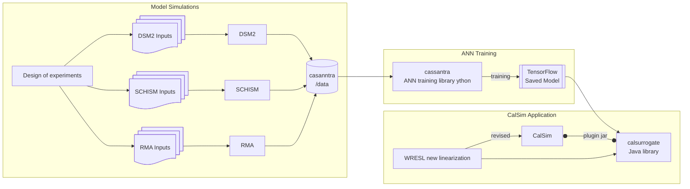

# calsurrogate
calsurrogate is the plug-in library for implementing surrogates with wrappers, with TensorFlow being the current implementation at DWR. 

calsurrogate is part of an associated suite of tools
                                                                

There is no independent wiki. See https://github.com/water-e/calsim3-dcr/wiki
