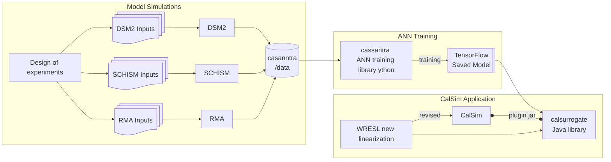

# calsurrogate
calsurrogate is the plug-in library for implementing surrogates with wrappers, with TensorFlow being the prototype implementation 

calsurrogate is part of an associated suite of tools
                                                                

The calsurrogate project repo is [here]([http://example.com/](https://github.com/CADWRDeltaModeling/casanntra) "Title")
An [example CalSim study]([http://example.com/](https://github.com/CADWRDeltaModeling/calsurrogate-test) "Title") is with the new surrogates. This example is not suitable for production study.

Notes:
# Repo for main example analogous to DCR
# Sequester the materials for eliminating NDOI and for making D-1641 small/large

Todo:
# Eliminate reduced_calls files, both at the station and the ANN level. 
# Fix MRDO implementations. Use required_flow instead.
# Fix X2 and find Fall X2
# Deal with all the extra stations which we do/don't have implemented.

